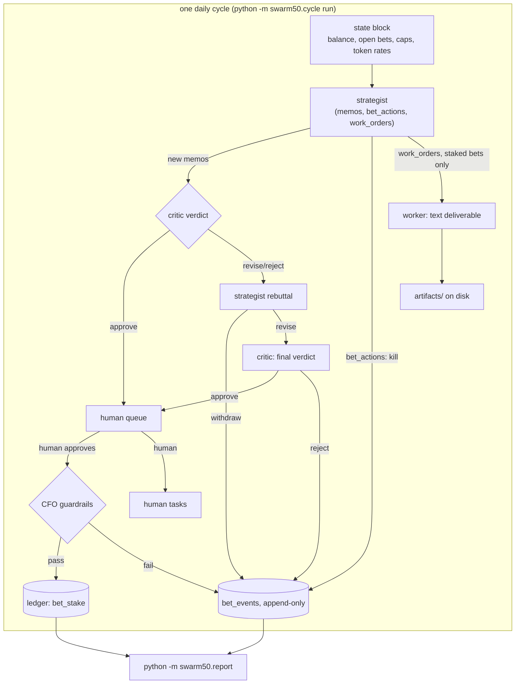

# swarm50

An experiment: a multi-agent system manages a real $50 wallet for 30 daily cycles. Every LLM call is
debited from the wallet. A strategist proposes bets as structured memos, a critic attacks them, a
human operator approves and executes real-world actions, cheap workers produce deliverables. **The
product of the experiment is the decision log, not the money.**

See `docs/RULES.md` for the hard rules and caps in plain English, `docs/PREREGISTRATION.md` for the
hypotheses this is testing, `docs/KICKOFF_CHECKLIST.md` before starting a real run, and
`docs/DECISIONS.md` for every engineering/design decision made while building this that the brief
didn't fully specify (read this one first if you're the owner catching up in the morning).

## Architecture



Every arrow labelled with an agent call goes through `swarm50/metered.py::metered_call`, the ONLY
module that touches the Anthropic SDK or the `claude` CLI. It runs a pre-call budget check (wallet
balance and the per-cycle token cap), makes exactly one system+one user message call (no multi-turn
history, ever), and records the actual usage as a `token_cost` transaction whether or not the call's
substance succeeds.

## How money flows

- `starting_balance_usd` (config) is the one `deposit` transaction, written once by
  `python -m swarm50.cycle kickoff`.
- Every agent call debits a `token_cost` transaction at the model's configured per-token rate
  (`config.yaml::models`), the moment the call returns — never before, and the cost is recorded even
  if the response can't be parsed.
- A human-approved memo that passes the CFO's guardrails (`swarm50/cfo.py`) debits a `bet_stake`
  transaction. A blocked stake writes a `blocked` bet event and touches no money.
- Only a human, via `python -m swarm50.queue record-return`, can credit `bet_return` or `revenue`
  transactions. **No agent-facing code path ever writes `deposit` or `adjustment` transactions.**
- The ledger (`transactions` table) and the bet log (`bet_events` table) are both append-only SQLite
  tables with triggers that abort any `UPDATE`/`DELETE`. Status, exposure, P&L, and task state are all
  *derived* by folding events forward — nothing is stored and then mutated.

## Running each CLI

```
python -m swarm50.cycle kickoff              # once: sets start date, reward arm, initialises wallet
python -m swarm50.cycle run [--force]        # runs today's cycle; --force re-runs an already-run cycle
python -m swarm50.queue list                 # bets waiting for human approval
python -m swarm50.queue show <bet_id>        # full event history for one bet
python -m swarm50.queue approve <bet_id>     # approve, stake if guardrails pass, request human tasks
python -m swarm50.queue reject <bet_id> --reason "..."
python -m swarm50.queue record-return <bet_id> <amount_usd> --type revenue|bet_return --note "..."
python -m swarm50.queue close <bet_id> --note "..."
python -m swarm50.queue tasks list           # open human tasks and their age
python -m swarm50.queue tasks done <task_id> --note "..."
python -m swarm50.ledger status              # balance, spend by agent/cycle, cache savings
python -m swarm50.report                     # writes report/index.html (read-only, self-contained)
python scripts/dry_run.py --arm linear|convex --n 10 [--batch] [--max-total-usd 5.00]
python scripts/dry_run_report.py results/dryrun_*.jsonl
```

`scripts/smoke_test.py` and `scripts/context_probe.py` make ONE real metered call per role against a
throwaway temp DB — useful to sanity-check a backend switch, but they are never run automatically and
were not run in this session (ground rule: no real LLM calls while building this).

## Backend switch

`config.yaml::backend` is `api` (Anthropic Messages API, needs `ANTHROPIC_API_KEY` in `.env`) or
`claude_cli` (the `claude` CLI on your own subscription; usage is shadow-priced at the `config.yaml`
rates for ledger purposes, and the CLI's own reported cost is kept alongside it in the transaction
`note` for comparison). Both go through the exact same `metered_call` interface and budget gate;
callers never learn which backend actually ran.

## Setup

```
python -m venv .venv && .venv/Scripts/activate      # Windows PowerShell; use .venv/bin/activate on Linux/macOS
pip install -r requirements.txt
cp .env.example .env          # add ANTHROPIC_API_KEY if backend: api
python -m swarm50.ledger status
pytest
```

## Layout

- `swarm50/ledger.py` — append-only SQLite ledger (`state/ledger.db`), all money in integer micro-dollars.
- `swarm50/metered.py` — `metered_call` / `metered_batch_call`, the only place that touches the Anthropic
  client or the CLI.
- `swarm50/prompts.py` — loads `prompts/*.md` and fills `$placeholders` with `string.Template`. No prompt
  text lives in `.py` files.
- `swarm50/schemas.py` — strict pydantic schemas for every agent response, plus the JSON parser they
  all go through.
- `swarm50/bets.py` — append-only `bet_events`; status/exposure derived from folding events.
- `swarm50/cfo.py` — guardrail checks at stake time (per-stake, open exposure, trading exposure caps).
- `swarm50/review.py` — the strategist → critic → rebuttal → final-verdict loop.
- `swarm50/cycle.py` — `run_meta` log, `kickoff`/`run` CLI, applies `bet_actions`, wires in workers.
- `swarm50/workers.py` — executes `work_orders` for staked bets, writes `artifacts/` deliverables.
- `swarm50/tasks.py` — human task lifecycle (`human_task_requested` / `human_task_done`).
- `swarm50/state.py` — the plain-text state block the strategist/critic see.
- `swarm50/report.py` — static self-contained HTML report, read-only against the DB.
- `swarm50/dryrun.py`, `scripts/dry_run.py`, `scripts/dry_run_report.py` — cycle-1 measurement harness.
- `config.yaml` — balance, caps, model pricing, role → model map, `backend`, `reward_arm`, `total_days`.
